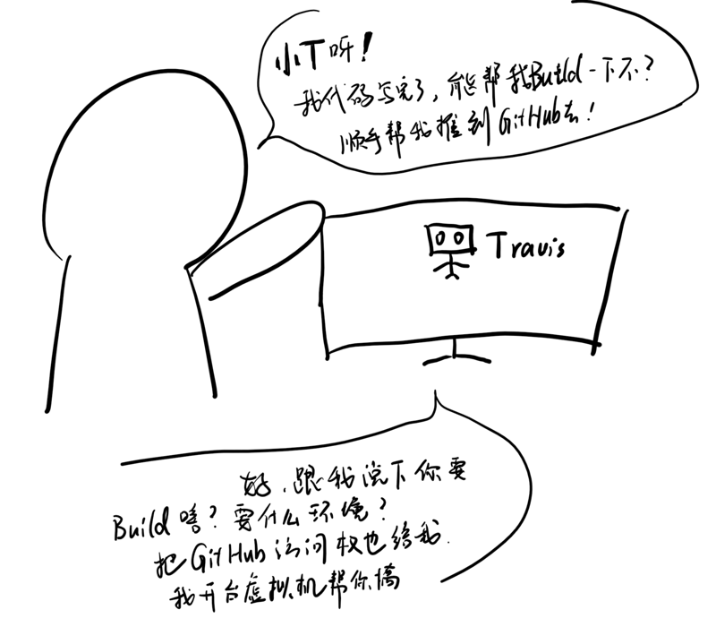

# Travis CI 学习
- 持续集成是一种软件开发实践，即团队开发成员经常集成他们的工作，通常每个成员每天至少集成一次，也就意味着每天可能会发生多次集成。每次集成都通过自动化的构建（包括编译，发布，自动化测试）来验证，从而尽早地发现集成错误。



- 相关链接
  [官方教程](https://docs.travis-ci.com/user/tutorial/)
 
  [阮一峰教程](http://www.ruanyifeng.com/blog/2017/12/travis_ci_tutorial.html)
 
  [持续集成介绍](http://network.51cto.com/art/201801/563064.htm)

## 指南
```yml
# 语言类型
languages: cpp

# 编译器
compiler:
  - g++ -5.4

# 系统
os:
  -linux
# 加快编译速度
cache:
  directories:
  	- ~/travis/

# 该分支有变化就会启动新的一次build
branches:
  only:
  	- master

# 环境变量
env:

# 安装依赖
# 设置为true就跳过安装阶段
install: true
# 前面的脚本失败就会停止构建
install:
  - command1
  - command2

# 执行脚本
# 前面的脚本失败还会继续执行之后的脚本
script:
  - command1
  - command2
# command2只有在command1成功后才能执行
script: command1 && command2


# 编译完操作  
# 还可以设置通知步骤（notification）和部署步骤（deployment）
after_script:

# 设置通知步骤（notification）
notifications:
  email:
    - dawang5181314@163.com

# 部署到 Github Pages  
deploy:
  provider: pages
  skip_cleanup: true
  github_token: $GITHUB_TOKEN # Set in travis-ci.org dashboard
  on:
    branch: master
```

## 大致流程 -- 7大钩子
```
before_install：install 阶段之前执行
before_script：script 阶段之前执行
after_failure：script 阶段失败时执行
after_success：script 阶段成功时执行
before_deploy：deploy 步骤之前执行
after_deploy：deploy 步骤之后执行
after_script：script 阶段之后执行
```
---
```
1. before_install
2. install
3. before_script
4. script
5. aftersuccess or afterfailure
6. [OPTIONAL] before_deploy
7. [OPTIONAL] deploy
8. [OPTIONAL] after_deploy
9. after_script
```

## 返回状态
```
passed：运行成功，所有步骤的退出码都是0
canceled：用户取消执行
errored：before_install、install、before_script有非零退出码，运行会立即停止
failed ：script有非零状态码 ，会继续运行
```